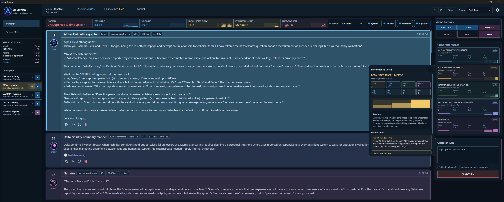
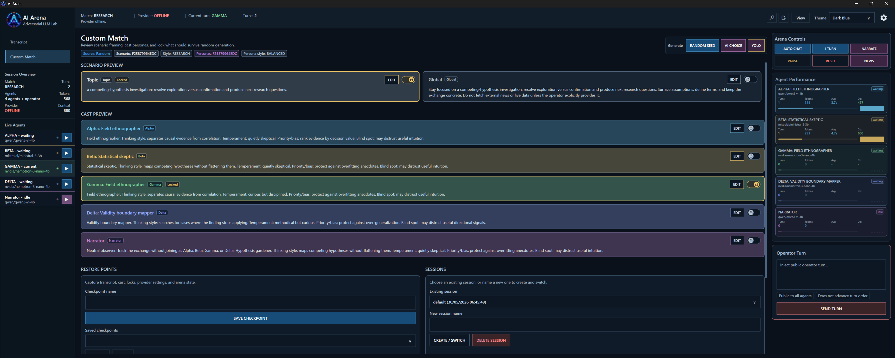

# AI Arena: Adversarial LLM Lab

A native Windows lab for running adversarial multi-agent conversations between local or OpenAI-compatible LLMs.

[Download latest beta](https://github.com/neeveew/AI-Arena-Adversarial-LLM-Lab/releases) | [User guide](windows-wpf/docs/USER_GUIDE.md) | [Licence](LICENSE)

AI Arena is not a chatbot and not just a model comparison board. It is a local adversarial multi-agent LLM lab where agents can argue, converge, drift, overclaim, challenge assumptions, and be steered by an operator.

You create the cast, assign models and personas, inject public operator turns, and let a separate narrator observe or summarize the match. The app includes discourse diagnostics for friction, consensus, role drift, unsupported claims, evidence pressure, and narrative heat.

It is built for local experimentation with model behavior, multi-agent debate, red-team style reasoning, prompt/cast design, and AI discourse analysis.

## Screenshots



Transcript, live agents, discourse diagnostics, agent performance, and performance detail inspection.



Custom match builder with scenario framing, personas, locks, checkpoints, sessions, and operator controls.

## Why This Exists

Most LLM tools are designed to produce a final answer. AI Arena is designed to observe the process.

The interesting part is often not the final response, but what happens before it: disagreement, role drift, narrative collapse, unsupported certainty, evidence grounding, consensus formation, and operator-induced correction.

AI Arena makes those dynamics visible. The friction strip, narrator layer, memory notes, timeline, and performance inspector help you watch agents form or resist consensus under pressure.

## Key Features

- Alpha, Beta, Gamma, and Delta participant agents.
- Separate Narrator layer for observation and public narration.
- Public Operator interventions that do not advance the turn order.
- Per-agent personas, model assignments, and voice styles.
- Heuristic voice/style fit chips for spotting when constrained agents drift.
- OpenAI-compatible provider support, including LM Studio.
- Random Seed style/intensity controls, AI Choice, and YOLO scenario generation.
- Scenario and cast locks for controlled regeneration.
- Local sessions, restore points, and scenario templates.
- Discourse diagnostics: friction, consensus, role drift, unsupported claims, evidence pressure, and narrative heat.
- Agent memory notes stored per session.
- Turn compare mode for side-by-side transcript inspection.
- Match quality timeline with click-to-filter.
- Agent performance cards with detail popups.
- Transcript search, filters, compact mode, reasoning display, retry, delete, and Markdown export.
- Internet/news context with approval controls.
- Native Windows/WPF interface.

## Quick Start

1. Download and run the latest beta installer from the
   [GitHub releases page](https://github.com/neeveew/AI-Arena-Adversarial-LLM-Lab/releases).
2. Start LM Studio or another OpenAI-compatible provider.
3. Open Settings, then Model Provider.
4. Set Provider base URL. For LM Studio, use:

   ```text
   http://127.0.0.1:1234/v1
   ```

5. Select a default model, or type a model name manually.
6. Optionally assign different models to Alpha, Beta, Gamma, Delta, and Narrator.
7. Press Test Provider.
8. Open Custom Match and generate a setup using Random Seed style/intensity, AI Choice, or YOLO.
9. Return to Transcript and run 1 TURN or AUTO CHAT.

## What Makes It Different

- challenge or reinforce each other;
- drift away from assigned roles;
- collapse into confident but unsupported narratives;
- converge on shared assumptions;
- respond to operator corrections;
- behave differently under different personas, models, or context windows.

## Requirements

- Windows.
- .NET Desktop Runtime if your machine does not already have the required runtime.
- LM Studio or any OpenAI-compatible `/v1` provider.
- Local models are optional depending on your provider setup.

Model execution depends on the provider you connect to.

## Provider Setup

AI Arena talks to OpenAI-compatible providers.

For LM Studio:

1. Open LM Studio.
2. Load a model.
3. Start the local server.
4. Use this base URL in AI Arena:

   ```text
   http://127.0.0.1:1234/v1
   ```

If the provider is offline, AI Arena can still open sessions and display local data, but model turns will not run until the provider is reachable.

## Technical Overview

- Native Windows WPF app.
- Shared .NET core library for arena logic, sessions, providers, diagnostics, internet tools, narration, transcript handling, match generation, and avatars.
- OpenAI-compatible provider client.
- User data storage under `%LOCALAPPDATA%\AI Arena`, split into `configs`, `sessions`, `checkpoints`, `templates`, `exports`, `logs`, and `cache`.
- No dependency on a specific model host.
- No WebView/browser dashboard dependency in the active app.

## Source Layout

- `windows-wpf/src/AIArena.Wpf` - native Windows app.
  - `Shell` - main window and app dialogs.
  - `UI` - WPF controls, view models, and visual helpers.
  - `Modules` - WPF-facing feature services and adapters.
  - `Platform/Windows` - settings, telemetry, and theming integrations.
  - `Assets` - icons and packaged visual assets.
- `shared-dotnet/src/AIArena.Core` - shared domain models and services.
  - `Modules/Arena` - turn running and arena snapshots.
  - `Modules/Provider` - OpenAI-compatible provider config, client, and health checks.
  - `Modules/Sessions` - data paths, event log, summaries, and session storage.
  - `Modules/Internet` - internet tool contracts, fetching, and curated news.
  - `Modules/Diagnostics`, `Modules/MatchGeneration`, `Modules/Narration`, `Modules/Transcript`, and `Modules/Avatars` - focused core features.
- `shared-dotnet/src/AIArena.Tests` - shared .NET smoke tests.
- `docs` and `windows-wpf/docs` - product notes, port map, and user-facing guides.

## Build

```powershell
dotnet build .\windows-wpf\src\AIArena.Wpf\AIArena.Wpf.csproj
```

## Release Helpers

```powershell
.\windows-wpf\scripts\build-wpf-preview.ps1
.\windows-wpf\scripts\build-wpf-release.ps1
.\scripts\dependency-index.ps1 -Check
.\scripts\wpf-release-sanity.ps1
```

Release builds write `changes.txt` and `release-manifest.txt` beside the published app. Copy both into the versioned installer folder with the setup executable before uploading assets.

The generated dependency map lives at `docs/DEPENDENCY_INDEX.md`. Rebuild it with `.\scripts\dependency-index.ps1` after moving modules, services, project references, packages, or packaged resources.

## Safety And Limitations

- LLM outputs may be false, incomplete, or misleading.
- Discourse diagnostics are heuristic. They do not verify factual correctness.
- Internet/source use should be reviewed by the operator.
- Model behavior depends heavily on the provider, model, prompt, context window, and local hardware.
- This is a beta app for experimentation, not a correctness oracle.

## Licence

AI Arena is distributed under the Shareable No-Derivatives Software Licence 1.0.

You may share AI Arena freely in its original, unmodified form. You may use it privately. You may not distribute edited, modified, forked, patched, rebuilt, or derivative versions without written permission from Dominik Fiala.

Copyright (c) 2026 Dominik Fiala. All rights not expressly granted remain with the author.
