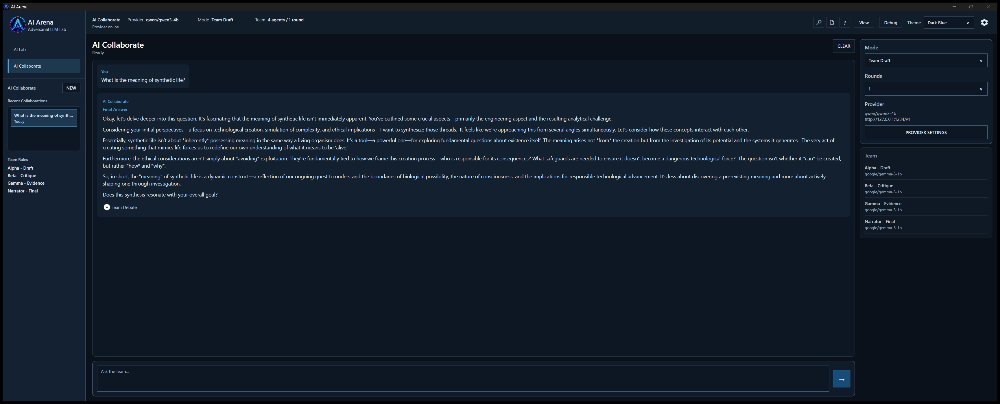

# AI Arena: Adversarial LLM Lab

A native Windows lab for running adversarial multi-agent conversations and collaborative AI team chats between local or OpenAI-compatible LLMs.

[Download 0.4.119-beta](https://github.com/neeveew/AI-Arena-Adversarial-LLM-Lab/releases/tag/v0.4.119-beta) | [All releases](https://github.com/neeveew/AI-Arena-Adversarial-LLM-Lab/releases) | [User guide](docs/USER_GUIDE.md) | [PowerShell control plane](CONTROLPLANE.md) | [Licence](LICENSE)

AI Arena is not a chatbot and not just a model comparison board. It is a local multi-agent LLM lab where agents can debate, collaborate, converge, drift, overclaim, challenge assumptions, and be steered by an operator.

The left rail exposes three first-class workspaces by default:

- **AI Lab** runs structured adversarial matches with live agents, operator turns, diagnostics, performance inspection, and transcript tooling.
- **Agent** is a default-on software-creation workspace with a Codex-inspired centered thread, bottom composer, visible session Approve All control, compact Progress/Build Evidence/Outputs rail, workspace and advanced controls tucked into collapsed drawers, model collaboration, staged command proposals, Auto Rescue for prose-only app replies, loop-guarded Auto Continue, generated artifact suggestions, terminal output capture, command history/replay, work briefs, and file-change receipts. Its left-rail entry can be shown or hidden independently under **Settings -> Agent workspace**; it is not gated by Debug.
- **AI Collaborate** runs a classic collaborative AI chat where Alpha, Beta, Gamma, and Narrator work together across configurable rounds to produce a final answer.

**AI World** is a separate experimental 3D view for AI Lab. It is hidden and off by default and is available only through the Debug controls.

You create the cast, assign models, personas, voices, and pressure profiles, inject public operator turns, and let a separate narrator observe, summarize, or synthesize. The app includes discourse diagnostics for friction, consensus, role drift, unsupported claims, evidence pressure, and narrative heat.

It is built for local experimentation with model behavior, multi-agent debate, AI collaboration, red-team style reasoning, prompt/cast design, and AI discourse analysis.

## Screenshot



AI Collaborate: a wide collaborative answer surface, persistent recent collaborations, configurable rounds, and a visible team setup panel.

## Why This Exists

Most LLM tools are designed to produce a final answer. AI Arena is designed to observe the process.

The interesting part is often not the final response, but what happens before it: disagreement, role drift, narrative collapse, unsupported certainty, evidence grounding, consensus formation, and operator-induced correction.

AI Arena makes those dynamics visible. The friction strip, narrator layer, memory notes, timeline, and performance inspector help you watch agents form or resist consensus under pressure.

## Key Features

- AI Lab for structured adversarial multi-agent matches with Battle Review run scoring and review packets.
- Default-on Agent left-rail workspace for software tasks with Planner/Reviewer/Builder collaboration, persisted project folders, capped workspace profiling, a Codex-like centered conversation lane, bottom composer, visible Approve All autonomy, a plus-menu popup for prompt presets/session controls, collapsed Workspace/Advanced drawers for deeper tuning, compact Progress/Build Evidence/Outputs rail, command preview, approval-gated or workspace-session-auto-approved Terminal/PowerShell execution, generated artifact suggestions, Auto Rescue for prose-only app replies, tolerant fenced/XML/JSON command extraction for local-model replies, bounded Auto Continue loops with duplicate/no-change guards, risky-preview manual stops, command history/replay, copied work briefs, Stage Next/Repair/Retry and Stage Verify handoffs, stdout/stderr capture, command-source labels, app file-snippet materialization, outside-workspace blocking, and file-change receipts. Show or hide it independently in **Settings -> Agent workspace** without enabling Debug.
- Durable Agent runbooks with stable plan/review/build/approval/execute/verify steps, workspace-bound persistence, evidence-linked checkpoints, interruption-safe restart recovery, and PowerShell inspect/resume/checkpoint commands.
- AI Collaborate for collaborative multi-agent chat with final synthesis, Red Team mode, and per-run review packets.
- Context-aware top-rail export for AI Lab transcripts and AI Collaborate chats.
- Surface-aware top commands that hide transcript-only Search, Export, and View actions outside the workspaces they control.
- Match Setup returns to the workspace and keyboard focus that opened it; Escape closes it without clearing transcript filters.
- Narrow-window right rail opens as an overlay drawer so the main workspace keeps its usable width.
- Default-on, token-authenticated local PowerShell control plane with a normal Settings toggle, typed commands for navigation, secret-free portable Match Setup export/import, cast sizing/relationship patterns/generation/history/replay, searchable and safely mutable Settings, full-state current-match forks with parent lineage, saved-session and checkpoint recovery, provider/Agent/Collaborate state, Collaborate run-review/trace inspection, arena turn/narration/reset, Internet state/toggle/diagnostics, self-screenshots, exports, live events, and an authoritative post-command state snapshot on every response.
- Configurable AI Collaborate rounds for deeper team drafting, critique, and hardening passes.
- Persistent recent collaborations with quick filters, search tokens, run metadata, mode/health badges, fork, repeat prompt, copy, compare-to-open, and delete actions.
- Distinct Alpha, Beta, Gamma, and Narrator debate cards before the final answer.
- Alpha, Beta, Gamma, and Delta participant agents.
- Separate Narrator layer for observation and public narration.
- Public, private, and narrator Operator interventions with route-aware draft meters and receipt tooltips.
- Operator quick intervention chips for evidence checks, consensus breaking, private role resets, narrator judgments, repairs, scope gates, handoff notes, and next-step framing.
- Per-agent personas, model assignments, voice styles, pressure profiles, and absurd persona-mixer constraints.
- Optional debug voice/style cue chips and voice drift enforcement for constrained agents.
- OpenAI-compatible provider support, including LM Studio.
- Wide Match Setup flyout for scenario framing, readiness badges, preset-gallery metadata, run-shape preview, pressure graph preview, copyable setup receipts, personas, locks, checkpoints, sessions, and operator controls.
- Random Seed presets with category, best-use, risk, and exact preset-match metadata, plus role-pack, pressure, style, absurdity controls, AI Choice, Wild Seed, and replayable generation history.
- Scenario and cast locks for controlled regeneration.
- Local sessions, restore points, and scenario templates.
- Discourse diagnostics: friction, consensus, role drift, unsupported claims, evidence pressure, and narrative heat.
- Agent memory notes stored per session.
- Turn compare mode for side-by-side transcript inspection.
- Match quality timeline with click-to-filter.
- Battle Review packets with verdict, score, risk flags, speaker share, token/latency totals, Run Trace triage, review queues, copyable judge notes, trace packets, and operator nudges.
- Agent performance cards with detail popups.
- Optional Debug-gated AI World 3D arena with speaker-follow camera, live pulse telemetry, speaker gaze/focus cues, narrator identity props, lock/voice/activity cues, minimap, inspector, chat bubbles, and richer stage lighting.
- AI Lab transcript search, filters, compact mode, reasoning display, retry, delete, export scope preview, and Markdown export.
- AI Collaborate Markdown export with prompts, final answers, Run Reviews, memory notes, and team trace metadata.
- Relationship Matrix pressure graph with coverage, hotspots, mutual-pair insight, draft patterns, and copyable current setup JSON.
- Match Setup preflight separates blockers from warnings, shows a visible checklist, and badges provider, persona, narrator, matrix, lock, agent, and history state.
- First-class SearXNG-backed web search and exact readable-page fetching, with an in-app Test Internet diagnostic, bounded source enrichment, domain-aware ranking, untrusted-evidence isolation, and numbered citation context.
- Native Windows/WPF interface.

## Quick Start

1. Download and run the latest beta installer from the
   [GitHub releases page](https://github.com/neeveew/AI-Arena-Adversarial-LLM-Lab/releases).
2. Start LM Studio or another OpenAI-compatible provider.
3. Open Settings, then **Models & provider**.
4. Choose a provider preset, press **Use preset**, and select a **Default model**.
5. Press **Test connection**.
6. If your provider needs a different endpoint or token, open **Custom connection**. For a standard LM Studio OpenAI-compatible endpoint, use:

   ```text
   http://127.0.0.1:1234/v1
   ```

7. Optionally open **Model recommendations** to scan local hardware and spread different models across roles.
8. Open AI Lab, then Match Setup, to create or replay a setup with Random Seed, AI Choice, or Wild Seed.
9. Run 1 TURN or AUTO CHAT to start an adversarial match.
10. Open Agent when you want the team to plan or review software work inside a selected project folder with approved command execution.
11. Open AI Collaborate when you want the team to produce a synthesized answer instead of running a turn-by-turn match.

## What Makes It Different

- challenge or reinforce each other;
- drift away from assigned roles;
- collapse into confident but unsupported narratives;
- converge on shared assumptions;
- respond to operator corrections;
- behave differently under different personas, models, or context windows.

## Requirements

- Windows.
- The release installer includes the required .NET Desktop Runtime; no separate .NET installation is needed.
- LM Studio or any OpenAI-compatible `/v1` provider.
- Local models are optional depending on your provider setup.

Model execution depends on the provider you connect to.

## Provider Setup

AI Arena talks to OpenAI-compatible providers.

For LM Studio:

1. Open LM Studio.
2. Load a model.
3. Start the local server.
4. Use this base URL in AI Arena:

   ```text
   http://127.0.0.1:1234/v1
   ```

If the provider is offline, AI Arena can still open sessions and display local data, but model turns will not run until the provider is reachable.

## PowerShell Control

The local, token-authenticated WPF control plane is enabled by default. Its toggle is under **Settings -> PowerShell Control** and is independent of Debug controls. Load the helper, then inspect or administer the active session's provider:

```powershell
. "$env:LOCALAPPDATA\Programs\AI Arena\ai-arena-control.ps1"

$provider = Get-AIArenaProvider
Set-AIArenaProviderConfig -BaseUrl "http://127.0.0.1:1234/v1" -ApiMode lmstudio_native -Model "google/gemma-4-e2b"
Update-AIArenaProviderModels
Test-AIArenaProvider
```

Provider tokens use `SecureString`: `$token = Read-Host "Provider token" -AsSecureString`, then `Set-AIArenaProviderConfig -ApiToken $token`. Responses expose only whether a token is configured.

AI Arena can also capture its own WPF window:

```powershell
$capture = Save-AIArenaScreenshot
$capture.data | Format-List path, byteSize, pixelWidth, pixelHeight
$capture.state

Save-AIArenaScreenshot "reviews/after-provider-test.png"
Save-AIArenaScreenshot "C:\Screenshots\AI-Arena.png"
```

With no path, screenshots use `%LOCALAPPDATA%\AI Arena\exports\screenshots\AI-Arena-yyyyMMdd-HHmmss-fff.png`, or the equivalent `exports\screenshots` folder under `AI_ARENA_DATA_DIR`. Relative paths resolve under that folder; absolute paths are allowed. Paths must end in `.png`, and existing files are never overwritten.

## Technical Overview

- Native Windows WPF app.
- Shared .NET core library for arena logic, sessions, providers, diagnostics, internet tools, narration, transcript handling, match generation, and avatars.
- OpenAI-compatible provider client.
- GPU-aware provider auto configuration for recommending model routing. LM Studio or the provider still controls final device placement and GPU offload.
- User data storage under `%LOCALAPPDATA%\AI Arena`, split into `configs`, `sessions`, `checkpoints`, `templates`, `exports`, `logs`, and `cache`.
- No dependency on a specific model host.
- No WebView/browser dashboard dependency in the active app.

## Source Layout

- `src/AIArena.Wpf` - native Windows app.
  - `Shell` - main window and app dialogs.
  - `UI` - WPF controls, view models, and visual helpers.
  - `Modules` - WPF-facing feature services and adapters.
  - `Platform/Windows` - settings, telemetry, and theming integrations.
  - `Assets` - icons and packaged visual assets.
- `src/AIArena.Core` - shared domain models and services.
  - `Modules/Arena` - turn running and arena snapshots.
  - `Modules/Provider` - OpenAI-compatible provider config, client, and health checks.
  - `Modules/Sessions` - data paths, event log, summaries, and session storage.
  - `Modules/Internet` - first-class web search and readable-page fetching.
  - `Modules/Diagnostics`, `Modules/MatchGeneration`, `Modules/Narration`, `Modules/Transcript`, and `Modules/Avatars` - focused core features.
- `tests/AIArena.Tests` - shared .NET smoke tests.
- `tests/AIArena.Wpf.Tests` - WPF app smoke tests.
- `docs` - product notes, dependency index, user-facing guides, and the WPF shell decomposition map.

## Build

```powershell
dotnet build .\src\AIArena.Wpf\AIArena.Wpf.csproj
```

For local web search, a development run uses a valid `searxng` payload beside the executable or from the newest versioned folder under `dist`. Set `AIARENA_SEARXNG_PAYLOAD_DIR` to either a payload root or its parent to override discovery. Release builds create and package the payload automatically.

## Release Helpers

```powershell
.\scripts\build-wpf-preview.ps1
.\scripts\build-wpf-release.ps1
.\scripts\build-wpf-installer.ps1
.\scripts\dependency-index.ps1 -Check
.\scripts\wpf-release-sanity.ps1
```

Release builds are self-contained by default, so the installed app never depends on a machine-wide .NET runtime. They verify the pinned CPython and SearXNG archives in `packaging/upstream-lock.json` and all Windows CPython wheels in `packaging/searxng-requirements-lock.txt` before installation. They write a hashed SearXNG payload inventory plus `changelog.md`, `changes.txt`, `github-release-notes.md`, `release-checksums.sha256`, `release-manifest.txt`, and `release-signing.json` beside the published app. `build-wpf-installer.ps1` requires a self-contained payload, creates a fresh versioned installer folder, refuses to overwrite an existing installer distribution, compiles the setup executable, copies the release metadata beside it, emits `SHA256SUMS.txt`, and runs release sanity.

Set `AIARENA_RUN_LIVE_INTERNET_SMOKE=1` and point `AIARENA_SEARXNG_PAYLOAD_DIR` at a built release before running the WPF harness to include a real bundled-search and hardened public-fetch diagnostic.

Authenticode signing is optional by default. For a publishable signed build, configure a production code-signing certificate and run `build-wpf-installer.ps1 -SigningPolicy Required`; the build fails before publishing when its signing prerequisites are unavailable. See [Release integrity and signing](docs/RELEASE_SECURITY.md) for certificate, SignTool, checksum, and upstream-lock guidance.

The generated dependency map lives at `docs/DEPENDENCY_INDEX.md`. Rebuild it with `.\scripts\dependency-index.ps1` after moving modules, services, project references, packages, or packaged resources.

## Safety And Limitations

- LLM outputs may be false, incomplete, or misleading.
- Discourse diagnostics are heuristic. They do not verify factual correctness.
- Internet/source use should be reviewed by the operator.
- Model behavior depends heavily on the provider, model, prompt, context window, and local hardware.
- This is a beta app for experimentation, not a correctness oracle.

## Licence

AI Arena is distributed under the Shareable No-Derivatives Software Licence 1.0.

You may share AI Arena freely in its original, unmodified form. You may use it privately. You may not distribute edited, modified, forked, patched, rebuilt, or derivative versions without written permission from Dominik Fiala.
