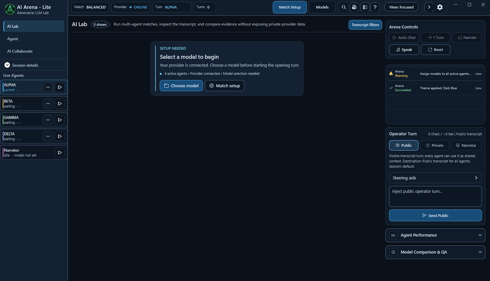

  

# AI Arena - Lite: Adversarial LLM Lab

Bring AI models together to debate ideas, collaborate on answers, and help build software, all in one Windows app. Choose the models and roles, guide the conversation, and explore how their answers develop.

**[Get the Windows installer](https://aiarena.me/downloads/)** · [User guide](docs/USER_GUIDE.md) · [Website](https://aiarena.me/) · [Updates on X](https://x.com/aiarena_me)

Current beta: [Download 0.4.141-beta](https://github.com/neeveew/AI-Arena-Adversarial-LLM-Lab/releases/tag/v0.4.141-beta) · [Release notes](packaging/changes/0.4.141-beta.txt)

## Three ways to use Lite

- **AI Lab:** Run debates between models, challenge their assumptions, and compare how they respond.
- **AI Collaborate:** Have an AI team draft, critique, and combine answers to your questions.
- **Agent:** Work on software projects with AI assistance, command previews, and approval controls.

Use different models for different roles, steer the conversation as it runs, and save or export sessions to revisit later.

**[Explore the full feature overview →](docs/OVERVIEW.md)**

## Get started

1. **Install Lite.** Download and run the Windows installer above.
2. **Connect your models.** Start LM Studio, Ollama, or another compatible model server. Open **Models** in Lite to discover servers and assign models to your agents.
3. **Try a conversation.** Choose a scenario in **Match Setup**, then run **1 Turn** in AI Lab. Try **AI Collaborate** for a team answer or **Agent** for a software task.

Start with the [LM Studio setup guide](https://aiarena.me/guides/lm-studio-ai-debate/) or [Ollama setup guide](https://aiarena.me/guides/ollama-ai-collaboration/). For model loading or remote providers, follow the [first-run walkthrough](docs/USER_GUIDE.md#article-quick-start).

**Requirements:** Windows x64 and a local or remote compatible model provider. The installer includes the .NET Desktop Runtime and offline Help; local web search is an optional component. AI models run through your chosen provider.

## Learn more

[Full feature overview](docs/OVERVIEW.md) · [Setup and troubleshooting](docs/USER_GUIDE.md) · [Developer documentation](docs/DEVELOPMENT.md) · [Send feedback](https://aiarena.me/feedback/)

Beta software for experimentation. Review AI-generated answers before relying on them.

[Licence](LICENSE): free to use privately and share unmodified. Distribution of modified versions requires written permission.
